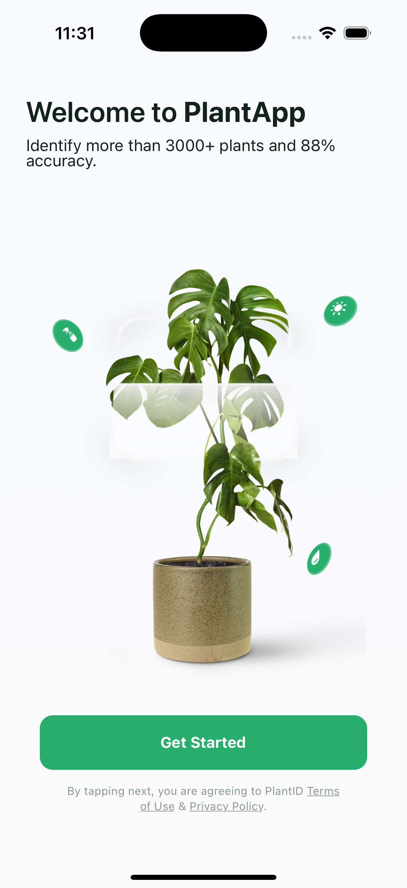
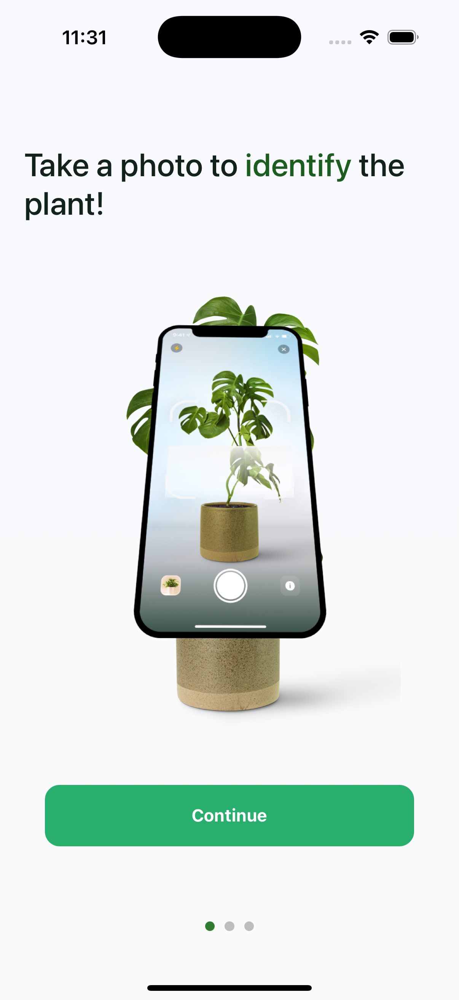
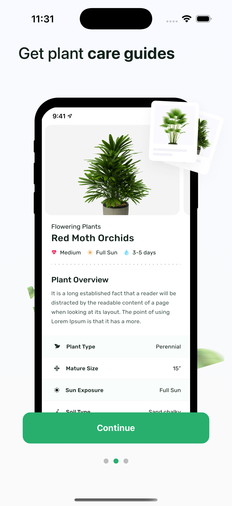
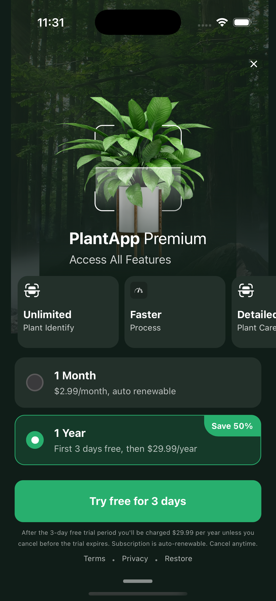
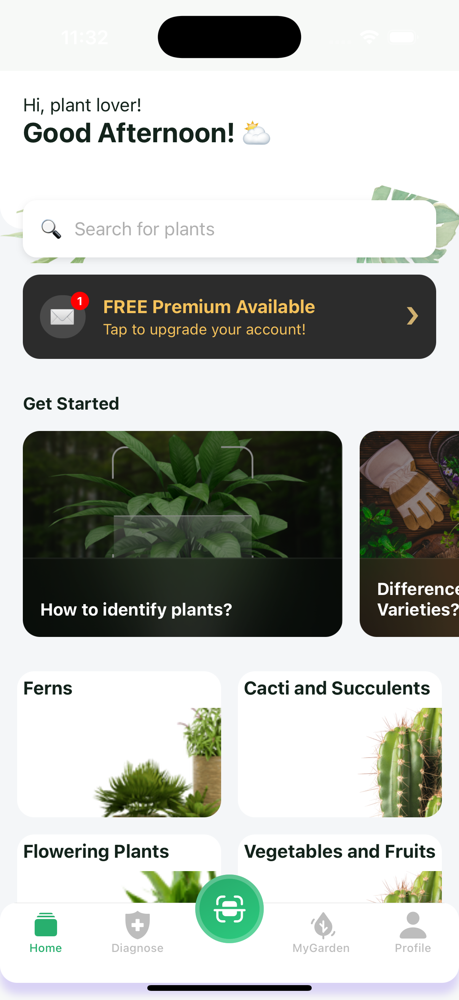

# PlantApp

## 🪴 About The Project

PlantApp is a mobile application built with React Native designed to help users identify plants, get detailed information about them, and manage their plant care. The app aims to provide a user-friendly interface for plant enthusiasts of all levels.

### Key Features (Implemented & Planned)

*   **Plant Identification:** (Planned - core feature)
*   **Onboarding Flow:** Guides new users through the app's initial setup.
*   **Premium Subscription Paywall:** Offers access to exclusive features.
*   **Home Page:** Displays plant categories, articles/questions, and a premium features banner.
*   **Tab Navigation:** Easy access to different sections of the app (Home, Scan, Diagnose, My Garden, Profile).
*   **API Integration:** Fetches plant categories and questions from a backend.

## 🚀 Getting Started

These instructions will get you a copy of the project up and running on your local machine for development and testing purposes.

### Prerequisites

*   Node.js (>= 18.x recommended)
*   Yarn or npm
*   Watchman (for macOS users)
*   Xcode (for iOS development)
*   Android Studio (for Android development)
*   Ruby and Bundler (for iOS CocoaPods)

Make sure you have completed the [React Native development environment setup](https://reactnative.dev/docs/environment-setup) for your specific OS.

### Installation

1.  **Clone the repository:**
    ```bash
    git clone https://github.com/Yunus5112/PlantApp.git
    cd PlantApp
    ```

2.  **Install JavaScript dependencies:**
    ```bash
    npm install
    # OR
    yarn install
    ```

3.  **Install iOS dependencies (CocoaPods):**
    ```bash
    cd ios
    pod install
    cd ..
    ```
    *(Note: If it's the first time or you have issues with `pod install`, you might need to run `bundle install` and then `bundle exec pod install` in the `ios` directory).*

### Running the Application

1.  **Start the Metro Bundler:**
    Open a terminal window in the project root and run:
    ```bash
    npm start
    # OR
    yarn start
    ```

2.  **Run on a Simulator/Emulator or Device:**
    Open another terminal window in the project root.

    *   **For iOS:**
        ```bash
        npm run ios
        # OR
        yarn ios
        ```
        *(If you encounter issues, try opening the `.xcworkspace` file in the `ios` directory with Xcode and building/running from there.)*

    *   **For Android:**
        ```bash
        npm run android
        # OR
        yarn android
        ```
        *(If you encounter issues, ensure you have an Android Virtual Device (AVD) set up in Android Studio or a physical device connected and recognized.)*

---

## 🛠️ Built With

*   **[React Native](https://reactnative.dev/)** - The framework used for building native mobile apps.
*   **[TypeScript](https://www.typescriptlang.org/)** - For static typing and improved developer experience.
*   **[React Navigation](https://reactnavigation.org/)** - For handling routing and navigation (Stack & Bottom Tabs).
*   **[Redux Toolkit](https://redux-toolkit.js.org/)** (with `react-redux`) - For state management.
*   **[React Native SVG](https://github.com/react-native-svg/react-native-svg)** - For using SVG images.
*   **[React Native Linear Gradient](https://github.com/react-native-linear-gradient/react-native-linear-gradient)** - For gradient backgrounds.
*   ESLint & Prettier - For code linting and formatting.

---

## 📂 Project Structure

PlantApp/
├── .git/
├── .bundle/
├── __tests__/
├── android/
├── ios/
├── node_modules/
├── src/
│   ├── assets/
│   │   ├── icon/         # Uygulama ikonları (SVG, PNG vb.)
│   │   ├── images/       # Genel imaj dosyaları (PNG, JPG vb.)
│   │   ├── screenShots/  # README için ekran görüntüleri
│   │   └── svg/          # SVG formatındaki grafikler ve ikonlar
│   ├── components/
│   │   ├── buttons/      # Yeniden kullanılabilir buton bileşenleri
│   │   └── cards/        # Yeniden kullanılabilir kart bileşenleri
│   ├── constants/
│   │   ├── DiagnoseScreenTexts.ts
│   │   ├── GetStartedScreenTexts.ts
│   │   ├── HomePageTexts.ts
│   │   ├── MyGardenScreenTexts.ts
│   │   ├── OnboardingFirstScreenTexts.ts
│   │   ├── OnboardingSecondScreenTexts.ts
│   │   ├── PaywallScreenTexts.ts
│   │   ├── ProfileScreenTexts.ts
│   │   └── ScanScreenTexts.ts
│   ├── navigation/
│   │   ├── BottomTabNavigator.tsx # Alt tab navigasyonunu yönetir
│   │   └── MainStackNavigator.tsx   # Ana stack navigasyonunu yönetir
│   ├── redux/
│   │   ├── slices/
│   │   │   └── dummySlice.ts      # Örnek bir Redux slice
│   │   └── store.ts               # Redux store konfigürasyonu
│   ├── screens/
│   │   ├── DiagnoseScreen.tsx
│   │   ├── GetStartedScreen.tsx
│   │   ├── HomePage.tsx
│   │   ├── MyGardenScreen.tsx
│   │   ├── OnboardingFirstScreen.tsx
│   │   ├── OnboardingSecondScreen.tsx
│   │   ├── PaywallScreen.tsx
│   │   ├── ProfileScreen.tsx
│   │   └── ScanScreen.tsx
│   ├── types/
│   │   └── index.ts               # Global TypeScript tip tanımlamaları
│   ├── utils/
│   │   └── scaling.ts             # Ekran boyutlandırma yardımcı fonksiyonları
│   └── custom.d.ts                # Özel TypeScript tip tanımlamaları (örn: SVG importları için)
├── vendor/
├── .eslintrc.js
├── .gitignore
├── .prettierrc.js
├── .watchmanconfig
├── App.tsx                        # Ana uygulama giriş noktası, Provider'ları ve ana navigatörü içerir
├── app.json
├── babel.config.js
├── Gemfile
├── index.js                       # React Native uygulama kayıt noktası
├── jest.config.js
├── metro.config.js
├── package-lock.json
├── package.json
├── README.md
└── tsconfig.json

---
## ✨ Features & Screenshots

**Get Started Screen**


**Onboarding Flow**




**Paywall Screen**

_Premium özelliklere erişim sunan ödeme duvarı._

**Home Page**

_Ana kategori ve içeriklerin listelendiği ana sayfa._

## 📧 Contact

E-mail: yunussolak5112@gmail.com
